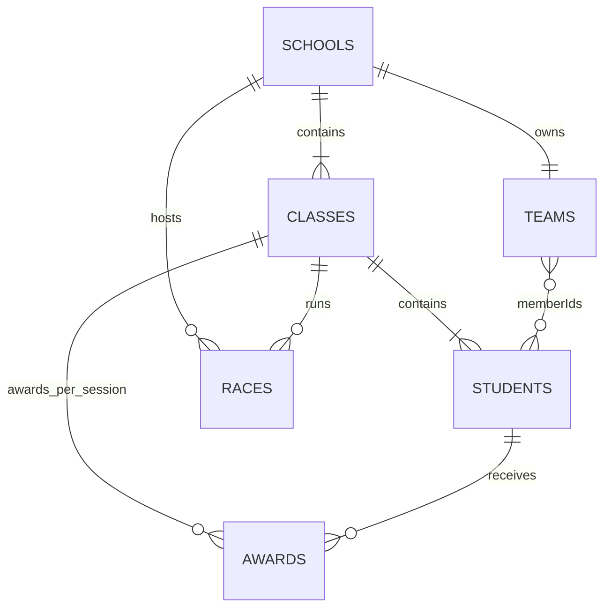

# Super Runners 資料結構

本文件說明目前前端讀取、暫存與匯出的遊戲世界資料。本機使用 IndexedDB，雲端使用 Firebase Realtime Database；固定資料優先從本機載入，動態資料依操作同步。完整雲端路徑、遷移、按需查詢與斷線補傳見 [雲端同步說明](cloud-sync.md)。

## 儲存位置與版本

- IndexedDB 資料庫名稱：`superrunners-taiwan-v3`
- 資料結構版本：`schemaVersion: 3`
- IndexedDB object store 版本：`2`，升級保留原有資料。
- 每個瀏覽器各自保有本機快取，同一帳號連結同一個雲端世界。
- 既有存檔首次連接時上傳至雲端。新的瀏覽器從雲端還原，不再重新隨機生成世界；有本機固定資料時不再重複下載。
- 舊版資料庫 `superrunners-taiwan-v1`、`superrunners-taiwan-v2` 會在啟動時清除。

資料庫使用一個 `meta` store、五個實體資料表與兩個同步資料表（其餘皆以 `id` 為 key）：

| Store | 用途 |
| --- | --- |
| `meta` | 世界設定、版本、收藏與追蹤清單等非表格資料 |
| `schools` | 全國國中與其班級資料 |
| `students` | 全國學生完整個人資料 |
| `teams` | 學校田徑隊及未來可擴充的代表隊 |
| `races` | 每一組百米賽的完成紀錄 |
| `awards` | 班級完整賽程完成後產生的前三名獎牌 |
| `outbox` | 與本機變更一起保存的待同步動作；雲端確認後移除 |
| `cloudCache` | 排名等按需查詢的快照及更新時間 |

每次寫入會同時更新 `meta` 與受影響資料表，避免成績、個人最佳與獎牌只寫入其中一部分。

## 完整匯出 JSON

匯出檔案將 `meta` 與原有五個實體 stores 合併成一個 JSON 物件；`outbox`、`cloudCache` 不匯出。這是本機目前快照，不代表所有尚未瀏覽學校的動態資料都已重新讀取。結構如下：

```js
{
  schemaVersion: 3,
  schoolTeamSelectionVersion: 1,
  country: { code: 'TW', name: '臺灣' },
  createdAt: '2026-10-06T00:00:00.000Z',
  seed: 'superrunners-tw-115-v3',
  source: {
    name: '教育部學校名錄',
    note: '學校名稱為真實公開資料；學生、能力與成績皆為虛構。'
  },
  exportedAt: '2026-10-06T00:00:00.000Z',

  favoriteSchoolIds: [],
  followedTeamIds: [],
  settings: { muted: false },

  schools: [],
  students: [],
  teams: [],
  races: [],
  awards: []
}
```

`exportedAt` 僅在匯出檔加入，不會寫回遊戲存檔。

完成雲端連接後，還會保存 `cloudBinding: { uid, worldId, databaseURL }`，避免錯誤帳號或不同世界互相覆寫。

## 關聯總覽



資料以 ID 連結，沒有巢狀複製整位學生資料。例外是 `races.results` 會保存學生姓名、學號、班級等當時快照，確保日後更改綽號或隊籍後，舊賽事紀錄仍保有當次資料。

## 世界中繼資料

| 欄位 | 型別 | 說明 |
| --- | --- | --- |
| `schemaVersion` | `number` | 儲存格式版本，目前為 `3`。版本不符時停止載入，避免錯誤覆蓋。 |
| `schoolTeamSelectionVersion` | `number` | 校隊初始選拔規則版本。 |
| `country` | `object` | 預設國家，目前為臺灣。 |
| `createdAt` | ISO 日期字串 | 此遊戲世界初次生成時間。 |
| `seed` | `string` | 初始隨機生成種子。 |
| `source` | `object` | 學校名錄來源說明。 |
| `favoriteSchoolIds` | `string[]` | 收藏學校 ID，可供校內比賽快速選擇。 |
| `followedTeamIds` | `string[]` | 顯示於「我的隊伍」的隊伍 ID。 |
| `settings.muted` | `boolean` | 背景音樂是否靜音。 |

## 學校與班級

### `schools[]`

```js
{
  id: 'school-id',
  name: '○○市立○○國民中學',
  city: '○○市',
  schoolNumber: 1,
  teamId: 'team-school-id',
  classes: [/* Class */]
}
```

學校基本欄位 `id`、`name`、`city` 來自學校名錄。每校固定三個年級；每個年級至少八班，班級數與班級學生數在世界初始化時確定並保留。

### `schools[].classes[]`

```js
{
  id: 'school-id-1-01',
  schoolId: 'school-id',
  grade: 1,
  number: 1,
  name: '一年級 1 班',
  color: '#...',
  studentIds: ['student-id-1', 'student-id-2']
}
```

| 欄位 | 說明 |
| --- | --- |
| `grade` | 年級數字 `1` 至 `3`，介面顯示為一年級、二年級、三年級。 |
| `number` | 班級序號。 |
| `color` | 班服上衣代表色，同班一致。 |
| `studentIds` | 此班學生 ID；每班初始化約 30 至 40 人，且不超過 50 人。 |

## 學生

### `students[]`

```js
{
  id: 'TPE0110101',
  studentNumber: 'TPE0110101',
  schoolId: 'school-id',
  classId: 'school-id-1-01',
  name: '王小明',
  nickname: '',
  gender: '男',
  grade: 1,
  age: 12,
  height: 154.3,
  weight: 46.8,

  explosiveness: 6,
  endurance: 5,
  stamina: 5,
  strength: 6,
  technique: 5,

  baseline100: 15.24,
  best100: null,
  isSchoolTeam: false,
  isCityTeam: false,
  isNationalTeam: false,
  ranks: { class: 0, grade: 0, school: 0, national: 0 }
}
```

| 分類 | 欄位 | 說明 |
| --- | --- | --- |
| 識別 | `id`, `studentNumber` | 目前相同，格式為縣市英文字母代碼、兩位校碼、年級、兩位班級、兩位座號。 |
| 所屬 | `schoolId`, `classId`, `grade` | 連結學校、班級與年級。 |
| 基本資料 | `name`, `nickname`, `gender`, `age`, `height`, `weight` | 名字、暱稱、性別、年齡及身體資料。身高單位為 cm，體重單位為 kg。 |
| 能力 | `explosiveness`, `endurance`, `stamina`, `strength`, `technique` | 每項為 1 至 10。 |
| 百米 | `baseline100`, `best100` | 預估百米秒數與實際最佳秒數。尚未參賽時 `best100` 是 `null`。排名與校隊選拔優先採實際最佳成績，否則採預估成績。 |
| 隊籍 | `isSchoolTeam`, `isCityTeam`, `isNationalTeam` | 是否為校隊、縣市代表隊、國家代表隊。 |
| 名次 | `ranks.class`, `ranks.grade`, `ranks.school`, `ranks.national` | 依百米成績計算的班級、年級、校內及全國排名。 |

學生實際參賽時會依能力與少量隨機性產生每次不同的秒數；保存一組成績後，若更快便更新 `best100` 並重算排名。

## 隊伍

### `teams[]`

```js
{
  id: 'team-school-id',
  type: 'school',
  name: '○○國中田徑隊',
  schoolId: 'school-id',
  city: '○○市',
  createdAt: '2026-10-06T00:00:00.000Z',
  memberIds: ['student-id-1'],
  awardIds: ['award-id-1']
}
```

目前每所學校初始化一隊 `type: 'school'` 的校隊。`memberIds` 是校隊成員，`awardIds` 是校隊成員獲得、且計入隊伍的獎牌。資料結構也預留給未來的縣市代表隊與國家代表隊，但尚未自動生成這兩種隊伍。

## 比賽紀錄

### `races[]`

每一筆 `races` 是一組最多八名選手的百米賽，不是一個完整班級賽程。

```js
{
  id: 'session-id-heat-1',
  sessionId: 'session-id',
  schoolId: 'school-id',
  classId: 'school-id-1-01',
  schoolName: '○○國中',
  className: '一年級 1 班',
  classColor: '#...',
  heat: 1,
  event: '100m',
  startedAt: '2026-10-06T00:00:00.000Z',
  finishedAt: '2026-10-06T00:00:18.000Z',
  results: [/* RaceResult */]
}
```

### `races[].results[]`

```js
{
  studentId: 'student-id-1',
  lane: 1,
  time: 14.82,
  place: 1,
  name: '王小明',
  nickname: '',
  gender: '男',
  height: 154.3,
  weight: 46.8,
  studentNumber: 'TPE0110101',
  className: '一年級 1 班',
  classColor: '#...',
  schoolName: '○○國中',
  dateTime: '2026-10-06T00:00:18.000Z'
}
```

`id` 是單組唯一 ID；再次保存相同 ID 時，系統會直接保留既有紀錄，避免重複建立。`sessionId` 將同一場多組、同一班或全校自動賽串在一起。

## 獎牌

### `awards[]`

當某班所有學生均已跑完該次 `sessionId` 的百米賽，系統依該班所有組別的秒數選出前三名並建立獎牌。

```js
{
  id: 'session-id-class-id-medal-0',
  sessionId: 'session-id',
  schoolId: 'school-id',
  classId: 'school-id-1-01',
  studentId: 'student-id-1',
  studentName: '王小明',
  studentNumber: 'TPE0110101',
  schoolName: '○○國中',
  className: '一年級 1 班',
  classColor: '#...',
  year: 2026,
  dateTime: '2026-10-06T00:00:18.000Z',
  event: '100m',
  competition: '校內百米・一年級 1 班',
  type: 'individual',
  medal: '金牌',
  place: 1,
  time: 14.82
}
```

`medal` 為 `金牌`、`銀牌` 或 `銅牌`；每個班級、每個賽程只會建立一次前三名獎牌。

## 全校自動百米賽的暫存狀態

全校自動百米賽使用前端記憶體中的 `autoMeet` 控制器，可在應用程式內切換首頁、學校資料或我的隊伍後持續進行。

```js
{
  active: true,
  schoolId: 'school-id',
  sessionId: 'auto-uuid',
  queue: [/* 依一年級至三年級、每班、每組排序的 heat */],
  heatIndex: 0,
  phase: 'countdown', // countdown | running | saving | saveerror | complete
  athletes: [/* 當前組選手與跑步 profile */],
  elapsed: -3,
  paused: false,
  speed: 1,
  startedAt: '...',
  finishedAt: '',
  error: ''
}
```

這個控制器**不寫入 IndexedDB**，因此重新整理網頁、關閉分頁或關閉瀏覽器時，尚未完成的自動賽程不會續跑。已完成並寫入 `races` 的組別、已更新的個人最佳成績與已產生的獎牌則會保留。

## 本機與雲端的對應

本機維持目前的 `schools`、`students`、`teams`、`races`、`awards` 物件，雲端拆為固定 `static`、動態 `dynamic` 與四種 `rankings` 索引，仍使用相同 ID 關聯。收藏、關注以 UID 隔離；音樂靜音設定仍屬於各瀏覽器的本機設定。完整對應見 [雲端同步說明](cloud-sync.md)。
